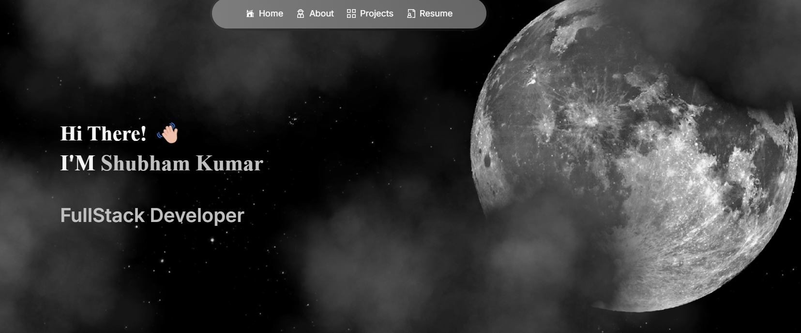

# 🚀 Next Level Portfolio

Welcome to my portfolio project! This dynamic and responsive portfolio is built using **Next.js** and **Tailwind CSS**, designed to showcase my skills, projects, and achievements professionally and interactively. Take a look around and explore my work!

## 🌟 Features

- **Responsive Design**: Optimized for all devices with fluid layouts and media queries.
- **Interactive UI**: Smooth animations and transitions powered by React.
- **Dynamic Content**: Easily updateable portfolio sections with modular components.
- **Tailwind CSS**: Utilizes Tailwind CSS for rapid styling and custom component design.

## 📸 Preview



## 🛠️ Technologies Used

- **Frameworks/Libraries**:

  - Next.js
  - Framer Motion
  - Aceternity UI
  - Javascript
  - Typescript

- **Styling**:

  - Tailwind CSS
  - CSS3

- **DevOps**:
  - GitHub Actions for CI/CD

## 🚀 Getting Started

### Prerequisites

- Node.js
- npm or yarn

### Installation

1. **Clone the repo**:
   ```sh
   git clone https://github.com/Aarav2002/Portfolio.git
   ```
2. **Install dependencies**:
   ```sh
   cd Next_Level_Portfolio
   npm install
   ```

### Running the Project

To start the development server, run:

```sh
npm run dev
```

To build the project for production, run:

```sh
npm run build
```

### 🌐 Deployment

This project is deployed using Netlify. You can view the live site [here](https://portfolio-blue-alpha-27.vercel.app/).

## 📈 Performance Optimizations

- **Code Splitting**: Implemented dynamic imports.
- **Optimized Assets**: Compressed images and minified CSS/JS.

## 🤝 Contributing

Contributions are welcome! Please fork this repository and create a pull request with your changes.

1. **Fork the Project**
2. **Create your Feature Branch** (`git checkout -b feature/AmazingFeature`)
3. **Commit your Changes** (`git commit -m 'Add some AmazingFeature'`)
4. **Push to the Branch** (`git push origin feature/AmazingFeature`)
5. **Open a Pull Request**

## 📧 Contact

Shubham Kumar - [LinkedIn](https://www.linkedin.com/in/shubham-kumar0702/)

Project Link: [GitHub](https://github.com/Aarav2002/Portfolio)

Made with ❤️ by Shubham Kumar
